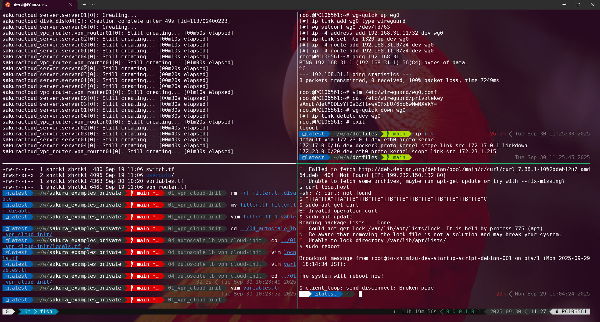

# 構築例 00 (WSL の Ubuntu24.04 に実行環境をセットアップする)
以下 README に記載のとおり、実行環境をセットアップするための ansible コードを用意しています。  
https://github.com/shztki/sakura_examples  

* パッケージのアップデート
* パッケージのインストール
* AWS CLI のインストール
* usacloud のインストール
* bashrc への追記
* direnvrc の作成


## 利用方法
```
$ cd ~/work/sakura_examples/00_dev_setup_ansible/
$ ansible-playbook -i dev_hosts wsl_ubuntu_24.yml --ask-become-pass
$ source ~/.bashrc
```


## 備考
* 自分用の設定ファイルを管理したくなったら、「dotfiles」で検索してみてください。実行環境セットアップ用の ansibleコード含め、githubのプライベートリポジトリで管理して、自分だけの実行環境セットアップツールとして整備していくのも楽しいです。  
参考までに、私は以下のようにカスタマイズして、視覚的にもわかりやすく、使いやすくなるようにしています。  

<p>
  
</p>

* shell は bash のままですが、個人的には fish がおすすめです。個別に設定をいじらなくても、便利な機能がすぐに使えます。
https://fishshell.com/  
ただし、direnv と [ghq](https://github.com/x-motemen/ghq) を併用する場合、fish-ghq をインストールすると思いますが、移動したときにすぐに direnv が発動しなくなります。  
Ubuntu24.04環境でインストールするバージョンにおいては、[`~/.config/fish/functions/__ghq_repository_search.fish`](https://github.com/decors/fish-ghq/blob/master/functions/__ghq_repository_search.fish) ファイルの 21行目のあとに以下を追記すると回避が可能ですので、ご参考までです。  
```
emit fish_prompt
```

* ペインを分けるのに自分は tmux を利用しています(デフォルトシェルを fish に変えるのはよくないといった情報もあったので、tmux を起動するとシェルが fish になるようにしています)。  

## 参考
https://developer.hashicorp.com/terraform/downloads  
https://docs.usacloud.jp/usacloud/  
https://docs.aws.amazon.com/cli/latest/userguide/getting-started-install.html  
https://direnv.net/  
https://docs.docker.com/engine/install/ubuntu/  

