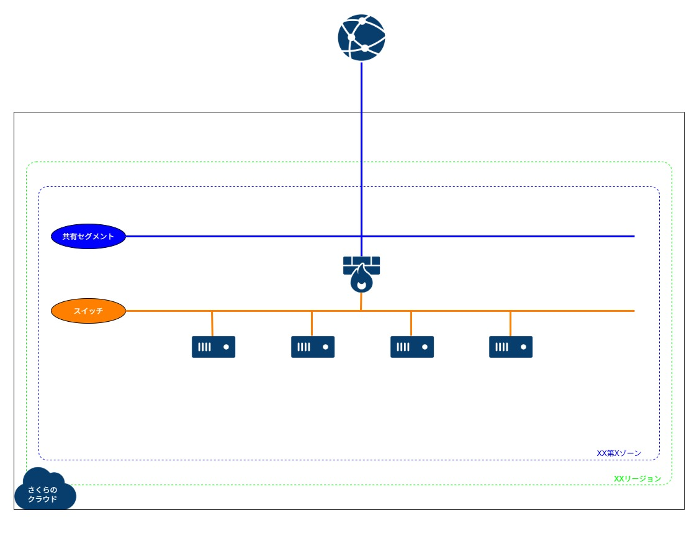
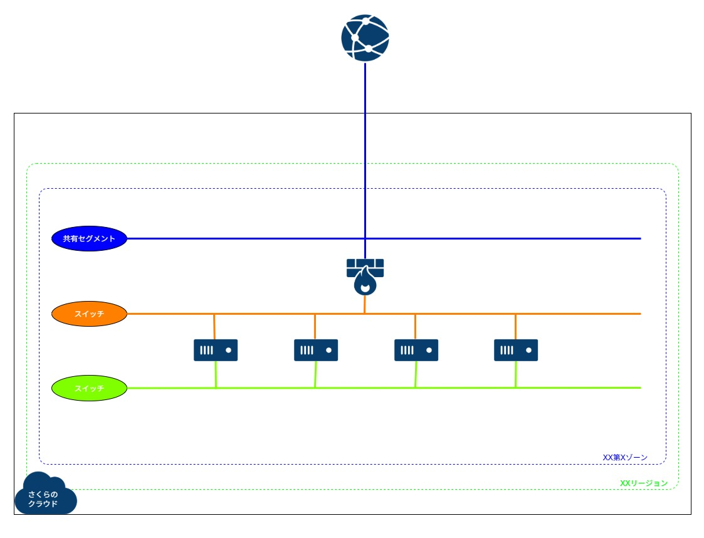
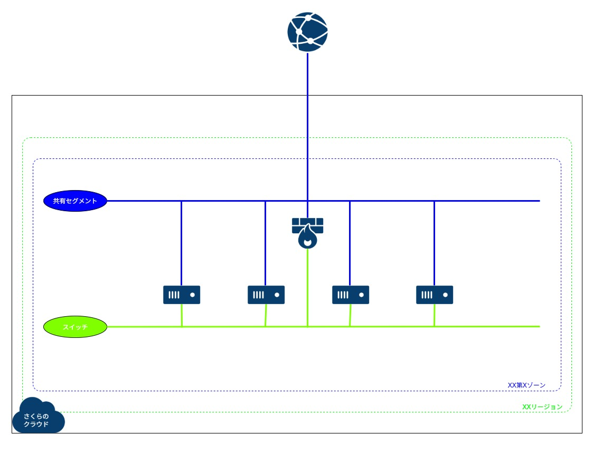
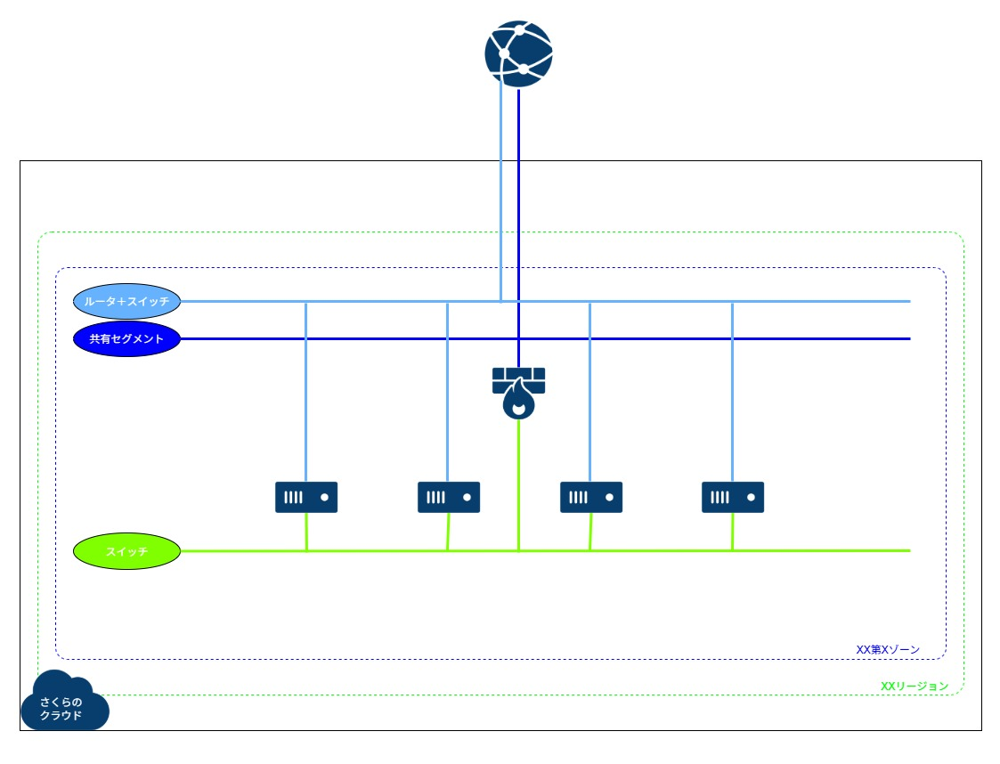

# 構築例 01 (VPNルータ配下に cloud-init対応アーカイブを利用してサーバを構築する)
さくらのクラウドで、VPNルータ配下に cloud-init対応アーカイブを使ってサーバを作成するためのコードです。  
Rocky/Alma/Ubuntu/Debian に対応しています。  
(試していませんが、Rocky/Alma と同じコードで RHEL も作成可能と思われます。RHEL は東京第2ゾーンにのみ存在するため、locals.tf 内ではコメントアウトしています)    

現状さくらのクラウドの cloud-init は network-config に対応していないようで、ネットワークの設定ができないようです。  
そのため、bootcmd や runcmd を駆使して設定する必要があります。  
共有セグメントに接続する(DHCPでIPがもらえる)以外の環境では、設定に工夫が必要なので、そちらを盛り込んだものにしています。  
以下が組み込まれています。  
(最終的には templatefile を利用して動的に変更できる形にしていますが、コード内でyamlencodeして動的に作成するパターンも参考までにコメントアウトして残しています。ただ更新はしていないため、記載内容は過去の状態のままなので利用する場合は注意)  

* SSH公開鍵設定
* クラウドユーザーへのパスワード設定(SHA512)
* パッケージアップデート、インストール
* ホスト名設定
* 1個目の NIC への静的IPアドレス設定(rocky10だけ初期状態が異なるようなので注意。コネクション名が cloud-init ens3 で接続済み。もしかすると network-config に対応したのかもしれないが未確認)
* コメントアウト: 2個目の NIC への静的IPアドレス設定およびVPN先へのスタティックルート設定(rocky10だけ初期状態が異なるようなので注意。コネクション名が cloud-init ens4 で接続済み。もしかすると network-config に対応したのかもしれないが未確認)
* DSR型のLB利用時のためのVIP設定とカーネルパラメータ設定
* NTP設定
* タイムゾーン変更
* ドキュメントルートへのテキスト配置


## 注意事項
* 2025/9/18 時点で、Terraform(terraform-provider-sakuracloud)ではモニタリングスイートの作成ができません。VPNルータで連携できるようになりましたが、VPNルータ側にもまだ指定方法が実装されていないようです。


## サンプル構成図
  

※variables.tf内の server0X 変数内の count を 0～10 に変更することで、各OSを利用したサーバを何台作成するか指定可能  
※全OSを1台ずつ作成する場合は、server01～04 の count を 1 にする  


## サンプル見積もり
[料金シミュレーション](https://cloud.sakura.ad.jp/payment/simulation/#/?state=e3N6OiJ0azFiIixzdDp7InVuaXQiOiJtb250aGx5IiwidmFsdWUiOjF9LHNpOiIiLGl0OntzZTpbe3A6OSxxOjEsZGk6W3twOjUscToxfV0sIm9zIjpudWxsLGxhOm51bGwsd2E6bnVsbCxpcGhvOmZhbHNlfV0sc3c6W3twOjEscToxfV0sdnA6W3twOjEscToxLHdhOm51bGx9XX19)  
※VPNルータ(スタンダード)とスイッチが固定で、サーバはサンプルで1台分費用を入れています  
※東京第2ゾーンでの例となっていますので、利用するゾーンにあわせて変更してください  


## 準備
ひとつ上の階層の README に記載の `実行環境をセットアップする` を実施してください。  


## 利用方法
* 以下を実行します。  
```
※作成
$ cd ~/work/sakura_examples/01_vpn_cloud-init/
$ terraform init
$ terraform plan
$ terraform apply

※削除
$ terraform destroy
```

* 作成完了後、VPNルータの WireGuard の publickey と、VPNルータ自身のグローバルIP が画面に出力されます。  
その情報と、自分の privatekey の情報を元に、以下で設定ファイルを作成して、WireGuard を起動します。    

```
$ sudo su -
# cd /etc/wireguard/
# umask 077
# cat privatekey 

# cat << EOF > wg0.conf
[Interface]
PrivateKey = 自分のprivatekey
Address = 192.168.31.11/32

[Peer]
PublicKey = VPNルータ作成後に出力されるpublickey
AllowedIPs = 192.168.31.0/24, 192.168.10.0/24
Endpoint = VPNルータ作成後に出力されるグローバルIPアドレス:51820
PersistentKeepalive = 25
EOF

※VPN起動
# wg-quick up wg0
# wg show

※VPN停止
# wg-quick down wg0

# exit
```

* VPN接続後、すべてのインスタンスにプライベートIPアドレスでアクセス可能です。  
念のため、グローバルIP 経由で 10022以降のポートを使い、各サーバへポートフォワーディングでアクセス可能な設定も実施しています。  
```
$ ssh -i ~/.ssh/id_rsa almalinux@192.168.10.10
$ ssh -i ~/.ssh/id_rsa rocky@192.168.10.20
$ ssh -i ~/.ssh/id_rsa ubuntu@192.168.10.30
$ ssh -i ~/.ssh/id_rsa debian@192.168.10.40

$ ssh -i ~/.ssh/id_rsa -p 10022 almalinux@VPNルータ作成後に出力されるグローバルIPアドレス
$ ssh -i ~/.ssh/id_rsa -p 10023 rocky@VPNルータ作成後に出力されるグローバルIPアドレス
$ ssh -i ~/.ssh/id_rsa -p 10024 ubuntu@VPNルータ作成後に出力されるグローバルIPアドレス
$ ssh -i ~/.ssh/id_rsa -p 10025 debian@VPNルータ作成後に出力されるグローバルIPアドレス
```


## 備考
* 本コードでは、変数 `server01` の `os` に指定する文言と locals.tf 内の文言を合わせることで、指定したタグにマッチするアーカイブが利用されるようにしています。  
(AlmaLinux8/9/10,RockyLinux8/9/10,Ubuntu22.04/24.04,Debian11/12)  
usacloud CLI 導入済みであれば、以下コマンドで cloud-init対応の Linux のアーカイブとそのタグを確認することができます。  
```
usacloud iaas archive ls --tags os-linux --tags cloud-init
```

* 利用するゾーンは `zone` という変数で指定しています。  

* 各種リソースの名前やタグの管理のために、 `terraform-null-label` というモジュールを使っています。  
管理がしやすくなるので、こういったものを使って統一することをおすすめします。

* コメントアウトしてありますが、適宜変更することで以下それぞれのパターンにも対応します
 1. VPNルータをプレミアム以上に変更するパターン
	* ルータ＋スイッチを作成してください(変数router01のcountを1に変更)
	* VPNルータはルータ＋スイッチと接続し、各インターフェースのネットワーク設定は冗長用に変更してください
 1. サーバの 2個目の NIC に switch02 を追加で接続するパターン
	* サーバ間だけのネットワークを作る場合です
	* switch02 を作ってください
	* cloud-init 内でコメントにしている設定該当部分を適宜有効にしてください
 1. サーバの 1個目の NIC は共有セグメント(インターネット)に接続し、2個目の NIC に switch02 を接続するパターン
	* switch01 は使わず、switch02 を作成してください
	* VPNルータは switch02 との接続に変更してください
	* ターミナル側の wg0.conf は必要に応じて AllowedIPs を修正してください(variables.tf の方で switch02 を switch01 の CIDR に変えるでも可)
	* cloud-init の 1個めのNICの設定部分はコメントアウトしてください(DHCPで設定されるため)
	* cloud-init 内でコメントにしている設定該当部分を適宜有効にしてください
	* パケットフィルタを作成してください(filter.tf.disable にしているので、有効化してください)
 1. サーバの 1個目の NIC はルータ＋スイッチに接続し、2個目の NIC に switch02 を接続するパターン
	* ルータ＋スイッチを作成してください(変数router01のcountを1に変更)
	* switch01 は使わず、switch02 を作成してください
	* VPNルータは switch02 との接続に変更してください
	* ターミナル側の wg0.conf は必要に応じて AllowedIPs を修正してください(variables.tf の方で switch02 を switch01 の CIDR に変えるでも可)
	* cloud-init の 1個めのNICの設定部分をルータ＋スイッチの IPアドレスになるように変更してください
	* cloud-init 内でコメントにしている設定該当部分を適宜有効にしてください
	* パケットフィルタを作成してください(filter.tf.disable にしているので、有効化してください)

<p>
  
  
  
  
</p>


## 参考
https://knowledge.sakura.ad.jp/38475/  
https://registry.terraform.io/providers/sacloud/sakuracloud/latest/docs  
https://manual.sakura.ad.jp/cloud/server/cloud-init.html  
