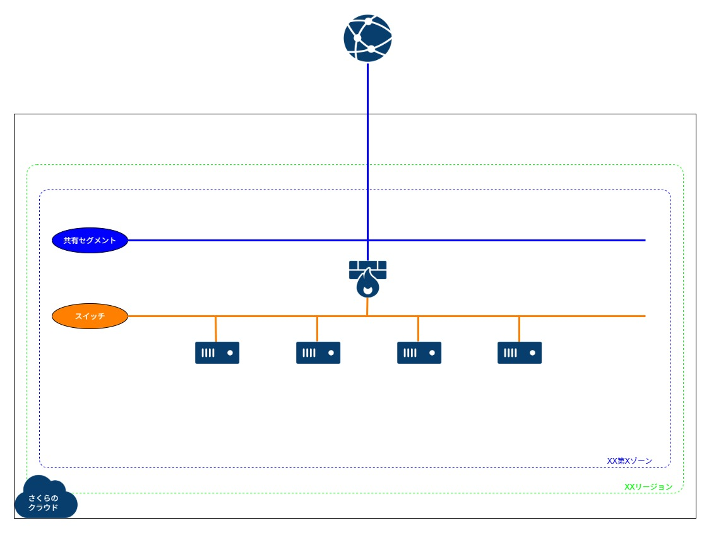
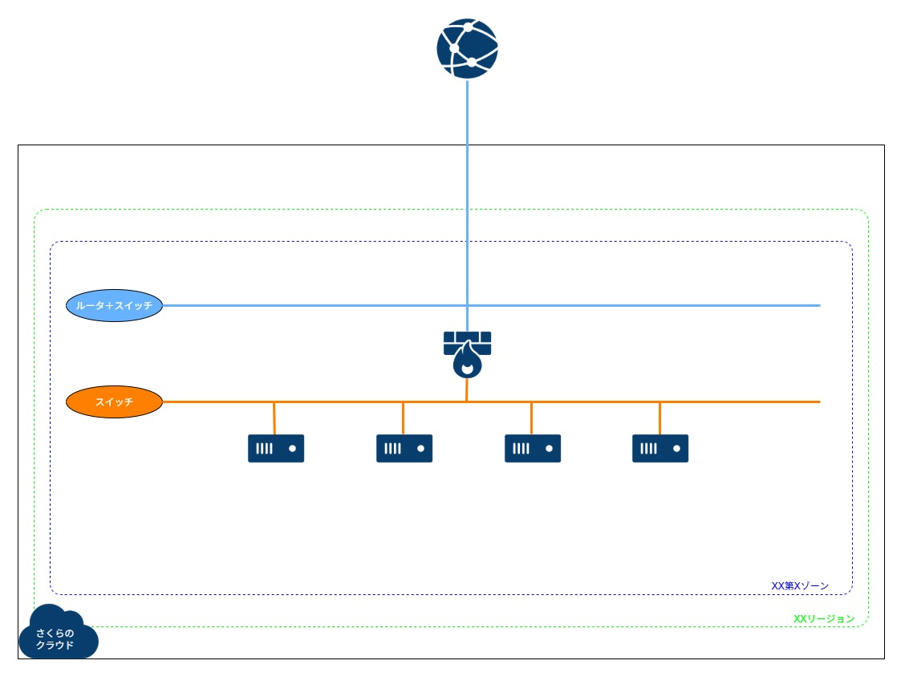
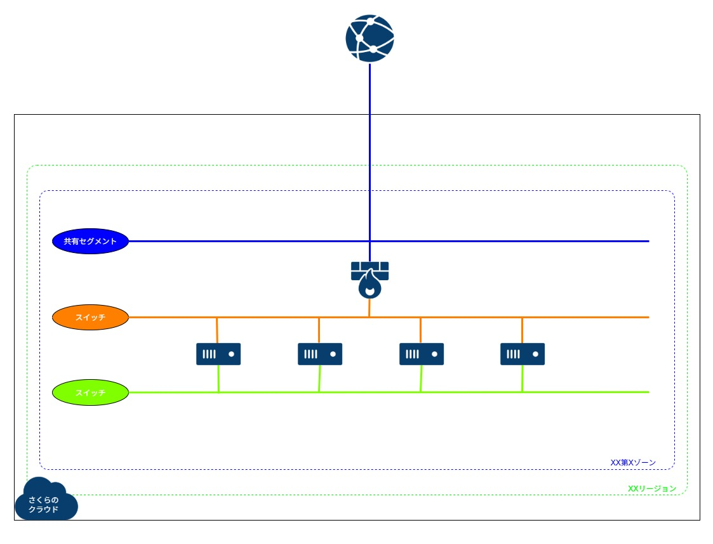
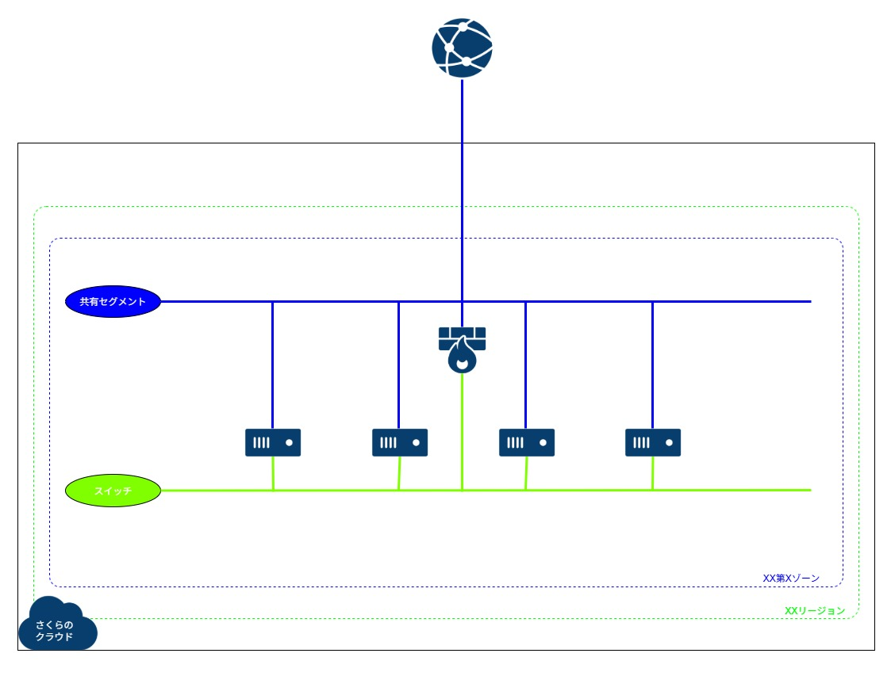
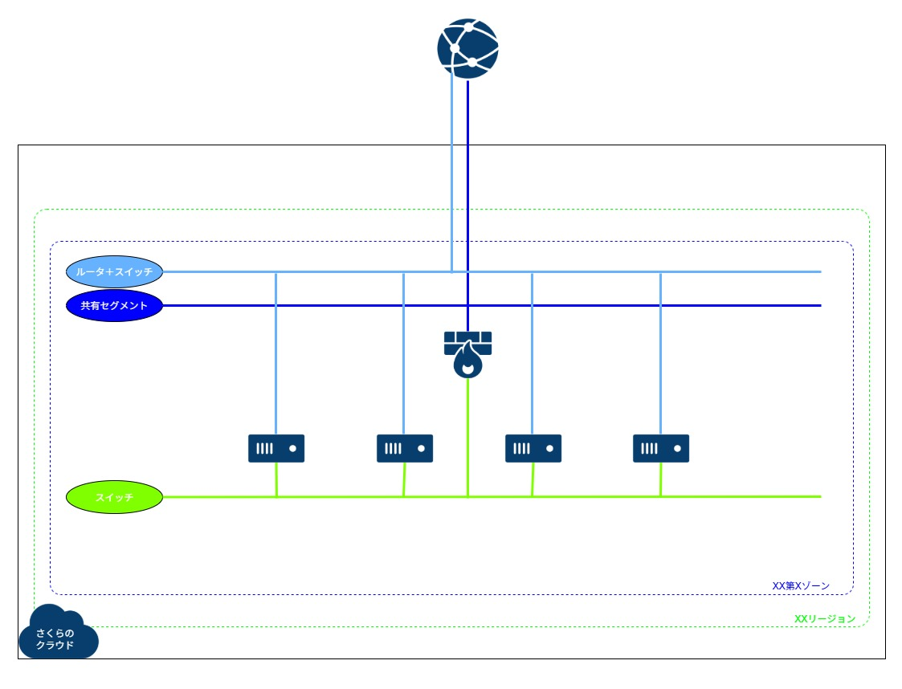

# 構築例 02 (VPNルータ配下にディスク修正(スタートアップスクリプト)対応アーカイブを利用してサーバを構築する)
さくらのクラウドで、VPNルータ配下にディスク修正(スタートアップスクリプト)対応アーカイブを使ってサーバを作成するためのコードです。  
Rocky/Alma/Ubuntu/Debian に対応しています。  
(試していませんが、Rocky/Alma と同じコードで Miracle Linux も作成可能と思われます。なおディスク修正(スタートアップスクリプト)対応の RHEL のパブリックアーカイブはありません)    

ディスク修正機能で、デフォルトのユーザーの設定、ホスト名や 1個めの NIC への IPアドレス設定、デフォルトゲートウェイ設定が可能です。  
DNS や NTP はあらかじめ設定されています。  
パスワードおよび SSH公開鍵が設定されるユーザーは、Ubuntu のみ ubuntu で、それ以外は root です。  
スタートアップスクリプトでは、以下を組み込んでいます。  

* 指定の名前でのユーザー作成(パスワードとSSH公開鍵はデフォルトユーザーと同じにする)
	* (ubuntuのみ)指定の名前が無い場合、ubuntu ユーザーの sudo用設定を実施
* OSアップデート、パッケージインストール
* 2個目の NIC への静的IPアドレス設定(プライベートIPアドレス)およびVPN先へのスタティックルート設定(alma10/rocky10は初期状態が異なるようなので注意。コネクション名が Wired connection 1 で接続済み)
* DSR型のLB利用時のためのVIP設定とカーネルパラメータ設定
* ドキュメントルートへのテキスト配置


## 注意事項
* 2025/9/18 時点で、Terraform(terraform-provider-sakuracloud)ではモニタリングスイートの作成ができません。  

* Ubuntu では、ディスク修正機能により作成される `/etc/netplan/01-netcfg.yaml` のパーミッションが正しくない(600になっていない)ために、スタートアップスクリプトのログ(/root/.sacloud-api/notes/ID.log)には WARNING がでます。  


## サンプル構成図
 

※variables.tf内の server0X 変数内の count を 0～10 に変更することで、各OSを利用したサーバを何台作成するか指定可能  
※全OSを1台ずつ作成する場合は、server01～04 の count を 1 にする  


## サンプル見積もり
[料金シミュレーション](https://cloud.sakura.ad.jp/payment/simulation/#/?state=e3N6OiJ0azFiIixzdDp7InVuaXQiOiJtb250aGx5IiwidmFsdWUiOjF9LHNpOiIiLGl0OntzZTpbe3A6OSxxOjEsZGk6W3twOjUscToxfV0sIm9zIjpudWxsLGxhOm51bGwsd2E6bnVsbCxpcGhvOmZhbHNlfV0sc3c6W3twOjEscToxfV0sdnA6W3twOjEscToxLHdhOm51bGx9XX19)  
※VPNルータ(スタンダード)とスイッチが固定で、サーバはサンプルで1台分費用を入れています
※東京第2ゾーンでの例となっていますので、利用するゾーンにあわせて変更してください  


## 準備
ひとつ上の階層の README に記載の `実行環境をセットアップする` を実施してください。  


## 利用方法
* 以下を実行します。  
```
※作成
$ cd ~/work/sakura_examples/02_vpn_startup-script/
$ terraform init
$ terraform plan
$ terraform apply

※削除
$ terraform destroy
```

* 作成完了後、VPNルータの WireGuard の publickey と、VPNルータ自身のグローバルIP が画面に出力されます。  
その情報と、自分の privatekey の情報を元に、以下で設定ファイルを作成して、WireGuard を起動します。    

```
$ sudo su -
# cd /etc/wireguard/
# umask 077
# cat privatekey 

# cat << EOF > wg0.conf
[Interface]
PrivateKey = 自分のprivatekey
Address = 192.168.31.11/32

[Peer]
PublicKey = VPNルータ作成後に出力されるpublickey
AllowedIPs = 192.168.31.0/24, 192.168.10.0/24
Endpoint = VPNルータ作成後に出力されるグローバルIPアドレス:51820
PersistentKeepalive = 25
EOF

※VPN起動
# wg-quick up wg0
# wg show

※VPN停止
# wg-quick down wg0

# exit
```

* VPN接続後、すべてのインスタンスにプライベートIPアドレスでアクセス可能です。  
念のため、グローバルIP 経由で 10022以降のポートを使い、各サーバへポートフォワーディングでアクセス可能な設定も実施しています。  
```
$ ssh -i ~/.ssh/id_rsa root@192.168.10.10
$ ssh -i ~/.ssh/id_rsa root@192.168.10.20
$ ssh -i ~/.ssh/id_rsa ubuntu@192.168.10.30
$ ssh -i ~/.ssh/id_rsa root@192.168.10.40

$ ssh -i ~/.ssh/id_rsa -p 10022 root@VPNルータ作成後に出力されるグローバルIPアドレス
$ ssh -i ~/.ssh/id_rsa -p 10023 root@VPNルータ作成後に出力されるグローバルIPアドレス
$ ssh -i ~/.ssh/id_rsa -p 10024 ubuntu@VPNルータ作成後に出力されるグローバルIPアドレス
$ ssh -i ~/.ssh/id_rsa -p 10025 root@VPNルータ作成後に出力されるグローバルIPアドレス
```


## 備考
* 本コードでは、変数 `server01` の `os` に指定する文言と locals.tf 内の文言を合わせることで、指定したタグにマッチするアーカイブが利用されるようにしています。  
(AlmaLinux8/9/10,RockyLinux8/9/10,Ubuntu22.04/24.04,Debian11/12)  
usacloud CLI 導入済みであれば、以下コマンドのような形(latest対象のOS名とバージョン番号は適宜変更)で対象の Linux のアーカイブ情報を確認することができます。  
```
usacloud iaas archive ls --tags os-linux --tags alma-9-latest
```

* 利用するゾーンは `zone` という変数で指定しています。  

* 各種リソースの名前やタグの管理のために、 `terraform-null-label` というモジュールを使っています。  
管理がしやすくなるので、こういったものを使って統一することをおすすめします。

* コメントアウトしてありますが、適宜変更することで以下それぞれのパターンにも対応します
 1. VPNルータをプレミアム以上に変更するパターン
	* ルータ＋スイッチを作成してください(変数router01のcountを1に変更)
	* VPNルータはルータ＋スイッチと接続し、各インターフェースのネットワーク設定は冗長用に変更してください
 1. サーバの 2個目の NIC に switch02 を追加で接続するパターン
	* サーバ間だけのネットワークを作る場合です
	* switch02 を作ってください
	* サーバ作成でコメントにしている設定該当部分等を適宜有効にしてください
 1. サーバの 1個目の NIC は共有セグメント(インターネット)に接続し、2個目の NIC に switch02 を接続するパターン
	* switch01 は使わず、switch02 を作成してください
	* VPNルータは switch02 との接続に変更してください
	* ターミナル側の wg0.conf は必要に応じて AllowedIPs を修正してください(variables.tf の方で switch02 を switch01 の CIDR に変えるでも可)
	* サーバ作成でコメントにしている設定該当部分等を適宜有効にしたり、不要部分をコメントアウトしてください
	* パケットフィルタを作成してください(filter.tf.disable にしているので、有効化してください)
 1. サーバの 1個目の NIC はルータ＋スイッチに接続し、2個目の NIC に switch02 を接続するパターン
	* ルータ＋スイッチを作成してください(変数router01のcountを1に変更)
	* switch01 は使わず、switch02 を作成してください
	* VPNルータは switch02 との接続に変更してください
	* ターミナル側の wg0.conf は必要に応じて AllowedIPs を修正してください(variables.tf の方で switch02 を switch01 の CIDR に変えるでも可)
	* サーバ作成でコメントにしている設定該当部分等を適宜有効にしたり、不要部分をコメントアウトしてください
	* パケットフィルタを作成してください(filter.tf.disable にしているので、有効化してください)

<p>
  
  
  
  
</p>


## 参考
https://registry.terraform.io/providers/sacloud/sakuracloud/latest/docs  
https://manual.sakura.ad.jp/cloud/storage/modifydisk/about.html  
