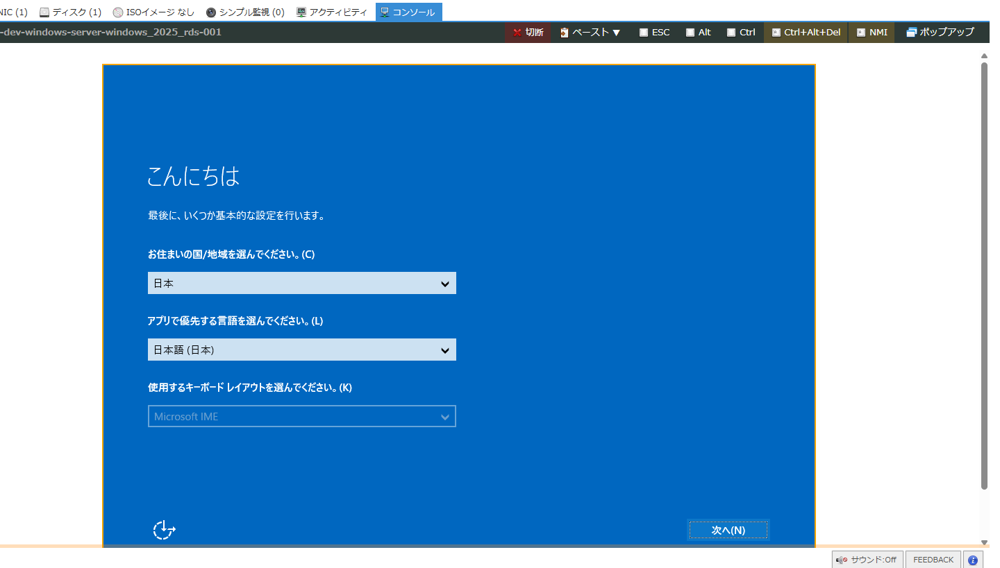
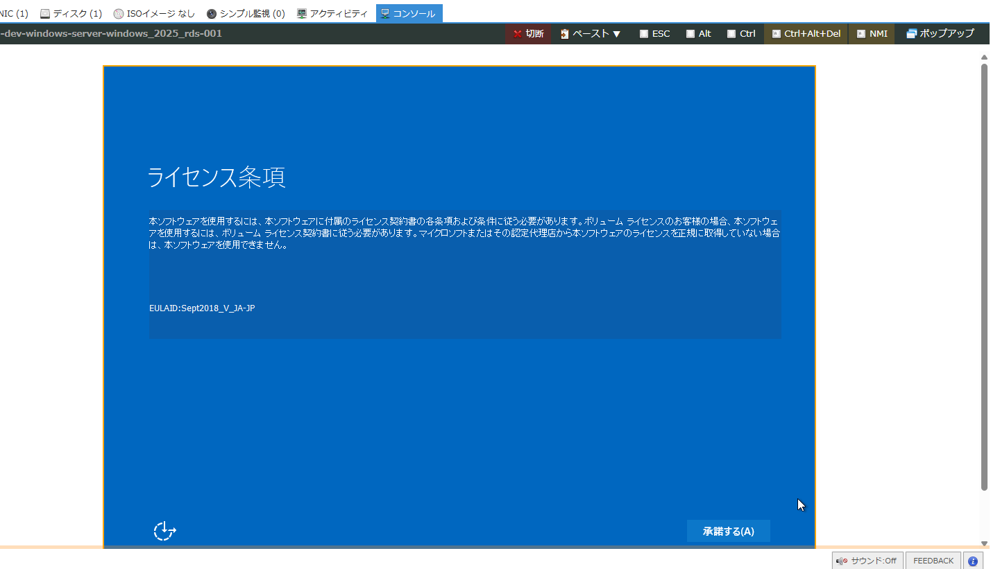
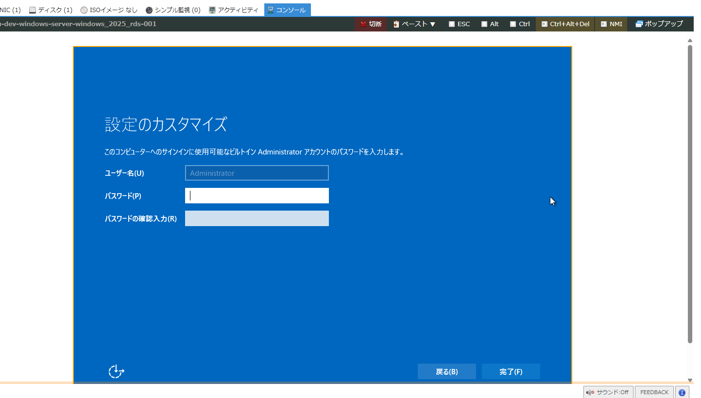
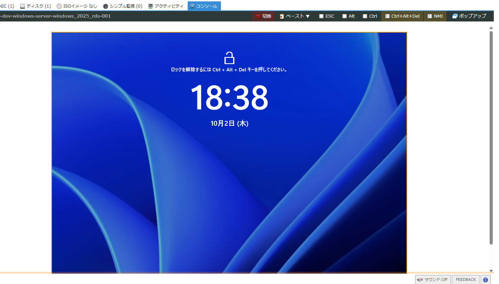
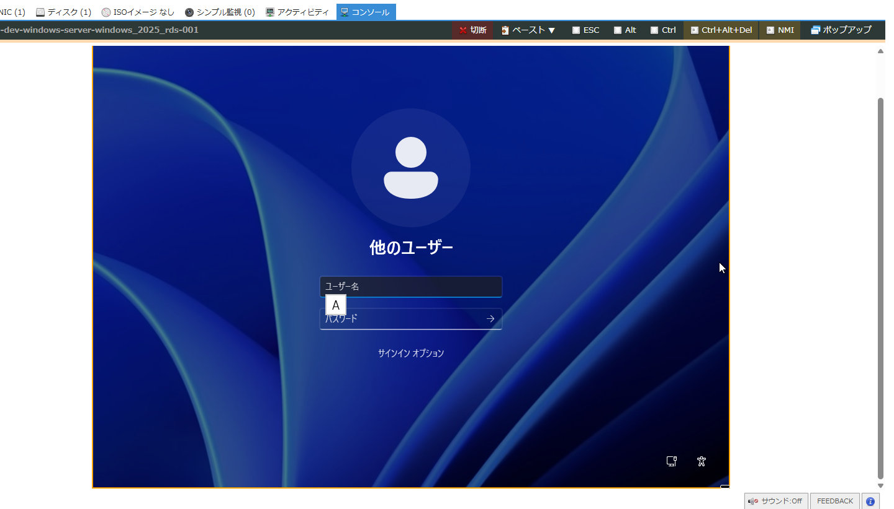
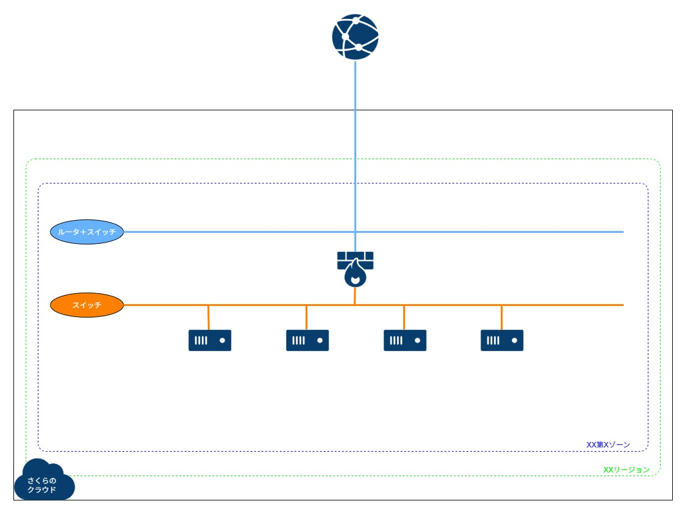

# 構築例 03 (VPNルータ配下に Windows Server のアーカイブを利用してサーバを構築する)
さくらのクラウドで、VPNルータ配下に Windows Server のアーカイブを使ってサーバを作成するためのコードです。  
素のOS、RDS用、RDS用(Office入り)、SQL Server Standard に対応しています。  
(試していませんが、他のバージョンも利用可能です)    

ディスク修正機能で、1個めの NIC への IPアドレス設定、デフォルトゲートウェイ設定のみが可能です。  
DNS や NTP はあらかじめ設定されています。  


## 注意事項
* 2025/9/18 時点で、Terraform(terraform-provider-sakuracloud)ではディスクの暗号化に対応できません。対応する場合、KMSキーを作成し、ディスクの暗号化を行う際に KMSキーのリソースIDを指定する、という処理が必要ですが、まだディスク側に指定方法が実装されていないようです。

* 2025/9/18 時点で、Terraform(terraform-provider-sakuracloud)ではモニタリングスイートの作成ができません。VPNルータで連携できるようになりましたが、VPNルータ側にもまだ指定方法が実装されていないようです。

* Windows Server ではディスク修正機能に制限があり、パブリックアーカイブ利用での新規作成時のみ、利用が可能です。  
https://manual.sakura.ad.jp/cloud/storage/modifydisk/windows.html  

* 初回起動時はライセンス条項の承諾、Administrator のパスワード入力が必要なため、コントロールパネル内のコンソール経由で実行しない限り、利用できませんし、外部からのアクセスもできません。  
https://manual.sakura.ad.jp/cloud/server/console.html  

<p>
  
  
  
  
  
</p>

* 上記のことから、Linux のように初期構築を自動化できないので、ご注意ください。  

* また、上記初回コンソール対応を実行しない場合、削除もできませんので、ご注意ください。(Terraform のテストで作成したが、ログインは不要でそのまま削除する、というのはできないようです。必ずコンソールでの初回対応は実施してください)  

* Windows Server のライセンス費用は高額かつ月額固定になっているものが多くあります。うかつに作成と削除を繰り返すと、ライセンス費用が膨大になりますので、十分にご注意ください。  
https://cloud.sakura.ad.jp/products/windows-server/  


## サンプル構成図
 

※variables.tf内の server0X 変数内の count を 0～10 に変更することで、各OSを利用したサーバを何台作成するか指定可能  
※全OSを1台ずつ作成する場合は、server01～04 の count を 1 にする  


## サンプル見積もり
[料金シミュレーション](https://cloud.sakura.ad.jp/payment/simulation/#/?state=e3N6OiJpczFjIixzdDp7InVuaXQiOiJtb250aGx5IiwidmFsdWUiOjF9LHNpOiIiLGl0OntzZTpbe3A6OSxxOjEsZGk6W3twOjcscToxfV0sIm9zIjp7cDoxLHE6MSxwcmk6bnVsbH0sbGE6bnVsbCx3YTpudWxsLGlwaG86ZmFsc2V9XSxzdzpbe3A6MSxxOjF9XSx2cDpbe3A6MSxxOjEsd2E6bnVsbH1dfX0=)  
※VPNルータ(スタンダード)とスイッチが固定で、サーバはサンプルで1台分(素のWindowsServer利用)でのライセンス費用も含めて入れています


## 準備
ひとつ上の階層の README に記載の `実行環境をセットアップする` を実施してください。  

## 利用方法
* 以下を実行します。  
```
※作成
$ cd ~/work/sakura_examples/03_vpn_windows-server/
$ terraform init
$ terraform plan
$ terraform apply

※削除
$ terraform destroy
```

* 作成完了後、VPNルータの WireGuard の publickey と、VPNルータ自身のグローバルIP が画面に出力されます。  
その情報と、自分の privatekey の情報を元に、以下で設定ファイルを作成してください。  
作成後、設定ファイルをご利用の Windows PC側の「ダウンロード」フォルダにコピーしておきます。  

```
$ sudo su -
# cd /etc/wireguard/
# umask 077
# cat privatekey 

# cat << EOF > wg0.conf
[Interface]
PrivateKey = 自分のprivatekey
Address = 192.168.31.11/32

[Peer]
PublicKey = VPNルータ作成後に出力されるpublickey
AllowedIPs = 192.168.31.0/24, 192.168.10.0/24
Endpoint = VPNルータ作成後に出力されるグローバルIPアドレス:51820
PersistentKeepalive = 25
EOF

# cp wg0.conf /mnt/c/Users/ユーザー名/Downloads/
```

* WSL内からリモートデスクトップはできないため、以下 WireGuard の公式サイトから Windows用のインストーラーをダウンロードしてご利用の PC にインストールしてください。  
https://www.wireguard.com/  

* ご利用の PC で WireGuard を起動したら、「トンネルの追加」で「ダウンロード」フォルダにコピーした `wg0.conf` を選択してください。そして「有効化」を押して VPN接続します。  

* VPN接続後、すべてのインスタンスにプライベートIPアドレスでアクセス可能です。  
念のため、グローバルIP 経由で 10022以降のポートを使い、各サーバへポートフォワーディングでアクセス可能な設定も実施しています。  
なお、ご自身の環境によっては、プライベートIP でのリモートデスクトップ時のユーザー名には `localhost\administrator` のように指定しないとつながらないこともあります。  


## 備考
* 本コードでは、変数 `server01` の `os` に指定する文言と locals.tf 内の文言を合わせることで、指定したタグにマッチするアーカイブが利用されるようにしています。  
(Windows Server の各種)  
usacloud CLI 導入済みであれば、以下コマンドのような形で対象のアーカイブ情報を確認することができます。  
タグでは単一のアーカイブまで絞ることが難しいため、本コード内では `names` でアーカイブを指定しています。(実際は複数リストアップされる場合、最初の一つを選択してくれるため、問題はありませんが、なるべく意図したアーカイブに限定されるようにしています)  
```
usacloud iaas archive ls --tags os-windows --tags distro-ver-2025
```

* 利用するゾーンは `zone` という変数で指定しています。  

* 各種リソースの名前やタグの管理のために、 `terraform-null-label` というモジュールを使っています。  
管理がしやすくなるので、こういったものを使って統一することをおすすめします。

* コメントアウトしてありますが、適宜変更することで以下のパターンにも対応します
 1. VPNルータをプレミアム以上に変更するパターン
	* ルータ＋スイッチを作成してください(変数router01のcountを1に変更)
	* VPNルータはルータ＋スイッチと接続し、各インターフェースのネットワーク設定は冗長用に変更してください

<p>
  
</p>
※Windows Server でも、もちろん Linux での構成例のように直接共有セグメントやルータ＋スイッチと接続して、直接グローバルIPアドレスを eth0 に持つ構成は可能ですが、セキュリティ上ファイアウォール配下にする方が望ましく、おすすめはしません。  

## 参考
https://registry.terraform.io/providers/sacloud/sakuracloud/latest/docs  
https://manual.sakura.ad.jp/cloud/server/os-packages/windows-server-plan/about.html  
https://manual.iij.jp/iot/doc/47987597.html  

