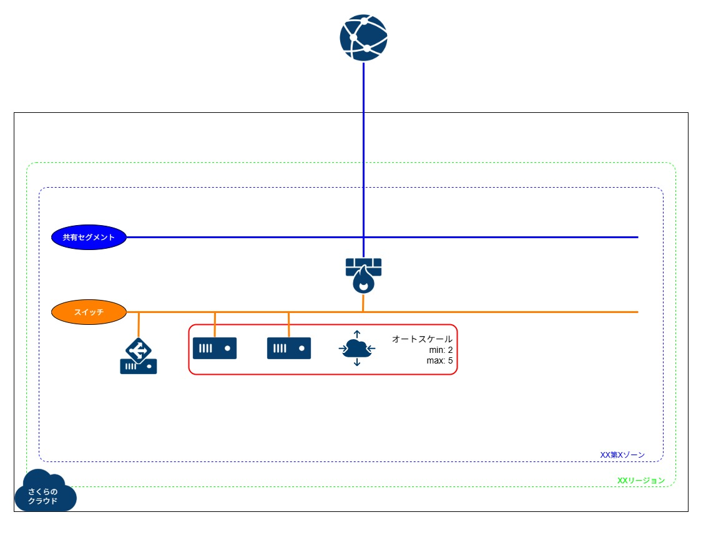

# 構築例 05 (VPNルータ配下に LB を利用した水平オートスケール環境をディスク修正(スタートアップスクリプト)対応アーカイブで構築する)
さくらのクラウドで、VPNルータ配下に LB を利用した水平オートスケール環境を構築するためのコードです。  
パブリックアーカイブはディスク修正(スタートアップスクリプト)対応の Rocky/Alma/Ubuntu/Debian を利用します。  
(試していませんが、Rocky/Alma と同じコードで Miracle Linux も作成可能と思われます。なおディスク修正(スタートアップスクリプト)対応の RHEL のパブリックアーカイブはありません)    


## 注意事項
* 2025/11/11 時点で、オートスケールではディスク暗号化には対応していません。

* 2025/9/18 時点で、オートスケールは cloud-init には対応していません。 `cloud_config:` 内でオートスケールが割り当てた IPアドレスを取得することができないため、スイッチと接続するインターフェースへの静的なIPアドレス設定を行うことができません。  
[マニュアル](https://docs.usacloud.jp/autoscaler/network/)にある、以下のような指定に対応しておらず、値が展開されないためのようです。  
```
{{ with index .NetworkInterfaces 0 }}{{ with .AssignedNetwork }}{{ .IpAddress }}/{{ .Netmask }}{{ end }}{{ end }}
```

* Windows Server もオートスケールには対応していません。Windows Server では限定的なディスク修正しか行えず、サービスに即時利用可能な状態で起動させる方法が無いためとなります。  
https://manual.sakura.ad.jp/cloud/storage/modifydisk/windows.html  

* ひとつ上の階層の `02_vpn_startup-script` 内の情報もあわせて参照ください。


## サンプル構成図
 

※variables.tf内の server01 変数内の count を変更することで初期配置台数を変更可能(その場合はオートスケールの min_size も変更すること)  


## サンプル見積もり
[料金シミュレーション](https://cloud.sakura.ad.jp/payment/simulation/#/?state=e3N6OiJ0azFiIixzdDp7InVuaXQiOiJtb250aGx5IiwidmFsdWUiOjF9LHNpOiIiLGl0OntzZTpbe3A6OSxxOjIsZGk6W3twOjUscToyfV0sIm9zIjpudWxsLGxhOm51bGwsd2E6bnVsbCxpcGhvOmZhbHNlfV0sc3c6W3twOjEscToxfV0sdnA6W3twOjEscToxLHdhOm51bGx9XSwibGIiOlt7cDoxLHE6MSx3YTpudWxsfV19fQ==)  
※VPNルータ(スタンダード)とスイッチ、ロードバランサ(スタンダードシングル)、サーバ 2台としています  
※ロードバランサを冗長にしたい場合は、 `lb.tf` にて IPアドレスをふたつ指定して作成してください  
※東京第2ゾーンでの例となっていますので、利用するゾーンにあわせて変更してください  


## 準備
* ひとつ上の階層の README に記載の `実行環境をセットアップする` を実施してください。  

* オートスケール実行用の権限を持った APIキーのリソースID を、環境変数として設定してください。  
現在のところ APIキーのリソースID を CLI や API で取得できないため、コントロールパネルで確認して、以下のように設定してください。  
別の構築例を実施していて、すでに設定している場合は不要です。  
```
$ cd ~/work/sakura_examples/
$ sed '/terraform_sakuracloud_variables_set/a \  export TF_VAR_api_key_id=リソースID' ~/.direnvrc
$ direnv allow
$ env | grep TF_VAR
```


## 利用方法
* 以下を実行します。  
```
※作成
$ cd ~/work/sakura_examples/05_autoscale_lb_vpn_startup-script/
$ terraform init
$ terraform plan
$ terraform apply

※削除
$ terraform destroy
```

* 作成完了後、VPNルータの WireGuard の publickey と、VPNルータ自身のグローバルIP が画面に出力されます。  
その情報と、自分の privatekey の情報を元に、以下で設定ファイルを作成して、WireGuard を起動します。  
別の構築例を実施していて、すでにファイルがある場合は、中身だけ書き換えるなどしてください。  
```
$ sudo su -
# cd /etc/wireguard/
# umask 077
# cat privatekey 

# cat << EOF > wg0.conf
[Interface]
PrivateKey = 自分のprivatekey
Address = 192.168.31.11/32

[Peer]
PublicKey = VPNルータ作成後に出力されるpublickey
AllowedIPs = 192.168.31.0/24, 192.168.10.0/24
Endpoint = VPNルータ作成後に出力されるグローバルIPアドレス:51820
PersistentKeepalive = 25
EOF

※VPN起動
# wg-quick up wg0
# wg show

※VPN停止
# wg-quick down wg0

# exit
```

* VPN接続後、すべてのインスタンスにプライベートIPアドレスでアクセス可能です。  
念のため、グローバルIP 経由で 10022以降のポートを使い、各サーバへポートフォワーディングでアクセス可能な設定も実施しています。  
```
※VIPでのWEB表示確認
$ curl http://192.168.10.250
$ curl http://VPNルータ作成後に出力されるグローバルIPアドレス

※SSH接続
$ ssh -i ~/.ssh/id_rsa root@192.168.10.10
$ ssh -i ~/.ssh/id_rsa root@192.168.10.11

$ ssh -i ~/.ssh/id_rsa -p 10022 root@VPNルータ作成後に出力されるグローバルIPアドレス
$ ssh -i ~/.ssh/id_rsa -p 10023 root@VPNルータ作成後に出力されるグローバルIPアドレス

※各サーバ内で負荷をかけ、オートスケールの発動を検証したい場合は、各サーバ内で以下のようなコマンドを実行する
$ stress-ng --cpu 0 --cpu-load 100 --timeout 60m &
```


## 備考
* コメントアウトしてありますが、適宜変更することで以下それぞれのパターンにも対応します。
 1. OSを変更する
	* 変数server01のosを変更
	* サーバ作成のスタートアップスクリプトを変更(RHEL系用、Ubuntu用、Debian用があります)
	* 変数autoscale01のfileを変更(RHEL系用、Ubuntu用、Debian用があります)

* オートスケールで min_size を指定したとしても、存在しない場合に自動的に作成されることはありません。(発動はトリガーによります。手動でスケールアウトさせる場合は別です)  
監視対象のサーバ名のプリフィックスと yaml 内で指定する `name (server_prefix_name)` を同一にするかどうかや、事前に別途最小数のサーバーを作成しておくのかによって、挙動にさまざまな差異が発生しますので、十分に注意して設計する必要があります。オートスケールで勝手に消されるなどの事故を防ぎたい場合は、ベースとなるサーバーは別途作成し、監視対象にはなるが、オートスケールの管理外となるようにする(ベースとなるサーバーの名称は `監視対象のプリフィックス文字列-base-XXX` のようにし、オートスケール側の server_prefix_name を、`監視対象のプリフィックス文字列-scale` のようにする)、といった設計も考えられます。  

* オートスケールの `type: "ServerGroup"` においては、plans は機能しないようです。  
https://docs.usacloud.jp/autoscaler/configuration/#resource_def_server  

```
    plans:
      - size: 2
      - size: 3
      - size: 5

    min_size: 2
    max_size: 5
```

上記の設定からいくつかのパターンを試しましたが、以下のとおりの挙動でした。  

1. plans のみにすると以下のエラーになります。min_size を残しても同様のエラーでした。max_size だけを残す場合はエラーはありませんでした。ただし、`この構成のように監視対象プリフィックスとオートスケール対象の server_prefix_name が同じ構成で min_size を無しにしてしまうと、オートスケール設定によりすべてのサーバが削除されてしまいますので、絶対に min_size の指定を無しにしたり 0 にしないように注意してください。`  

	```
	不適切な要求です。パラメータの指定誤り、入力規則違反です。入力内容をご確認ください。 リクエストが不正です。3 errors occurred: * resource=ServerGroup plan: plan.size must be between min_size and max_size: size:2 * resource=ServerGroup plan: plan.size must be between min_size and max_size: size:3 * resource=ServerGroup plan: plan.size must be between min_size and max_size: size:5
	```

1. min_size/max_size を指定してあると、その範囲内で 1台ずつスケーリングします。3台の後、次の発動時に一気に 2台作って 5台になる、という挙動にはなりません。つまり、plans は機能していないように見受けられます。  

1. 絶対にやってはいけませんが、min_size だけを省略することは可能だったので、plans と max_size のみにしてみたところ、それでも結局挙動は変わらず 1台ずつスケーリングしました。3台の次のスケーリングで、一気に 5台になることはありません。ということで、plans は設定する意味が無いと考え、本コードからは除外しています。  

* オートスケールでソースアーカイブ指定時に tags を利用しても正常に機能しないようです。以下のエラーになりました。  
`source_archive:` では [<name_or_resource_selector>](https://docs.usacloud.jp/autoscaler/configuration/#resource_selector)のはずなので、tags も本来は機能するはずと思うのですが、不可でした。  
`※2025/11/11 に確認したところ、修正されていたため、本コード内での指定方法はこちらにしています。`  

```
※autoscale.tf内で templatefile に以下を記載
os_tags             = local.linux_archives[var.server01["os"]].tags,

※yaml内で以下を記載
      disks:
        - source_archive:
            tags: [%{ for i, os_tag in os_tags ~}"${os_tag}"%{ if i < length(os_tags) - 1 }, %{ endif }%{ endfor ~}]
        - os_type: "${os_name}"


※plan実行時は以下
                  disks:
                    - source_archive:
                        tags: ["os-linux", "alma-9-latest"]

※しかし、実行すると以下のエラーになり、正常に検索できていない
Error: creating SakuraCloud AutoScale is failed: Error in response: &iaas.APIErrorResponse{IsFatal:true, Serial:"ee84ef62ecd032c4e215e257a3b97c0f", Status:"400 Bad Request", ErrorCode:"bad_request", ErrorMessage:"不適切な要求です。パラメータの指定誤り、入力規則違反です。入力内容をご確認ください。\nリクエストが不正です。1 error occurred:\n\t* resource=ServerGroup source archive not found with: {zone: tk1b, ID: , Names: [], Tags: [os-linux alma-9-latest]}"}
```

* オートスケールでソースアーカイブ指定時に names を利用してもうまくいかないことがあります。  
途中まで名称が同じだと、複数ヒットしてしまい、エラーになるようです。  

```
※autoscale.tf内で templatefile に以下を記載
os_name             = data.sakuracloud_archive.linux_archives[var.server01["os"]].name,

※yaml内で以下を記載
      disks:
        - source_archive:
            names: "${os_name}"


※plan実行時は以下
                  disks:
                    - source_archive:
                        names: ["Ubuntu Server 24.04.2 LTS 64bit"]

※しかし、実行すると以下のエラーになり、正常に利用できない
Error: creating SakuraCloud AutoScale is failed: Error in response: &iaas.APIErrorResponse{IsFatal:true, Serial:"71574d4b106424c1bec8fd5d2d9c6d7d", Status:"400 Bad Request", ErrorCode:"bad_request", ErrorMessage:"不適切な要求です。パラメータの指定誤り、入力規則違反です。入力内容をご確認ください。\nリクエストが不正です。1 error occurred:\n\t* resource=ServerGroup multiple source archive found with: {zone: tk1b, ID: , Names: [Ubuntu Server 24.04.2 LTS 64bit], Tags: []}, archives: [0xc0002672c0 0xc000267900]"}
```

* アーカイブの指定方法には os_type を利用することも可能です。  
os_type が存在するかは、以下を参照ください。  
https://docs.usacloud.jp/autoscaler/configuration/#resource_def_server_group  
https://github.com/sacloud/iaas-api-go/blob/7cfcd90757d27993640bbc412e7e32526ba9218b/ostype/archive_ostype.go#L97  
`※2025/11/11 に確認したところ、Alma/Rocky Linux 10 はまだ対応していないようで、以下のエラーでしたが、いずれは対応するものと思われます。`  

```
※autoscale.tf内で templatefile に以下を記載
 os_name             = replace(replace(var.server01["os"], "_latest", ""), "_", ""),
 
※yaml内で以下を記載
      disks:
        - os_type: "${os_name}"

※plan実行時は以下
                  disks:
                    - os_type: "almalinux10"


※しかし、実行すると以下のエラーになり、正常に検索できていない
Error: creating SakuraCloud AutoScale is failed: Error in response: &iaas.APIErrorResponse{IsFatal:true, Serial:"9402a09892844a1ebb1f8ab9e39808dc", Status:"400 Bad Request", ErrorCode:"bad_request", ErrorMessage:"不適切な要求です。パラメータの指定誤り、入力規則違反です。入力内容をご確認ください。\nリクエストが不正です。1 error occurred:\n\t* resource=ServerGroup unsupported ostype.ArchiveOSType: Custom"}
```

* なお以下のようにしてリソースID で指定することも可能ですが、パブリックアーカイブの場合は OS のバージョンがあがると更新されて無くなる可能性がありますし、自分で管理するゴールデンイメージもアップデートして変わる可能性もあると考えられるため、基本的には os_type や名前での指定をおすすめします。  
```
※autoscale.tf では以下のように指定
    source_archive_id   = data.sakuracloud_archive.linux_archives[var.server01["os"]].id,

※テンプレートファイル内では以下のように指定
      disks:
        - source_archive:
            id: ${source_archive_id}
```

* 実運用を考えてオートスケールに耐えうる構成とする場合、起動テンプレートとなるゴールデンイメージの管理や(名前でしかアーカイブを指定できないため、他とプリフィックスが一致しないように注意)、ログ等の外部保存、ステートレスにするなど、システムの設計をよく検討する必要があります。  


## 参考
https://docs.usacloud.jp/autoscaler/  
https://registry.terraform.io/providers/sacloud/sakuracloud/latest/docs  
https://manual.sakura.ad.jp/cloud/autoscale/autoscale.html  


