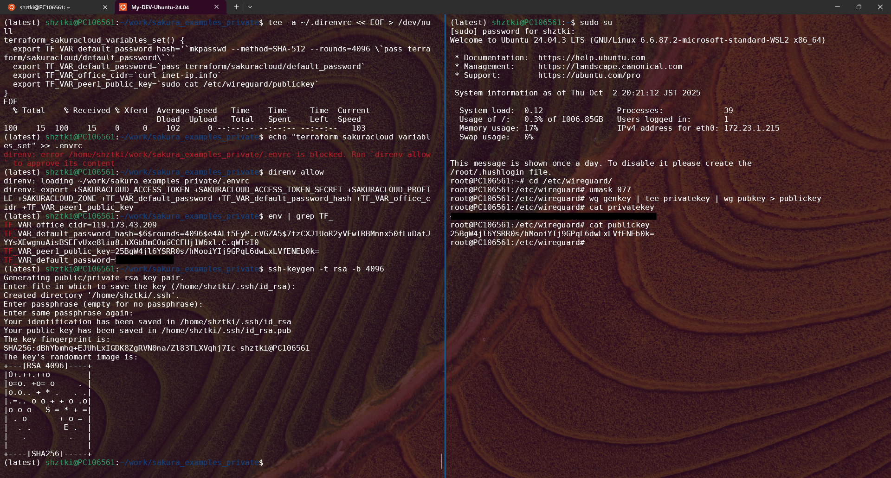

# さくらのクラウド 構築参考情報
さくらのクラウドを構築するために必要な情報やツール、コードの個人的なまとめです。  
前提として以下ツールの実行環境が必要です。  

+ terraform
+ usacloud
+ aws cli
+ ansible
+ docker
+ wireguard-tools

実行環境の選択肢はいくつかありますが、手軽でかつ手元で操作できるということで、Windows を使っているなら WSL がおすすめです。  
Windows11 で WSL を使い、Ubuntu24.04 の実行環境を整備する方法を以下に記載します。  


## WSL で Ubuntu24.04 の環境を用意する
* まずはターミナルということで、 Windows Terminal をインストールしてください。(Microsoft Store でインストール可能です)  
https://learn.microsoft.com/ja-jp/windows/terminal/install  

* 以下の情報などを参考に WSL やディストリビューションをインストールしてください。(Windows PowerShell のコマンドラインでも、Microsoft Store でもインストール可能です)  
https://learn.microsoft.com/ja-jp/windows/wsl/install  

1. Windows Terminal を起動する。

1. インストールされているものがあるか確認する。
	```
	wsl -l -v
	```

1. インストール可能な一覧を確認する。
	```
	wsl -l -o
	```

1. 名前を指定して対象のディストリビューションをインストールする。
	```
	wsl --install Ubuntu-24.04 --name My-DEV-Ubuntu-24.04
	```
	* Microsoft Store からだと同じ名前のものはひとつしかインストールできません。PowerShell で `--name` を指定すれば、同じディストリビューションを複数インストール可能です。
	* インストール完了後、 `ユーザー名を指定して、パスワードを入力します。` その後 `exit` でいったんログアウトしてください。

1. 今は不要ですが、対象のディストリビューションを停止したいときは以下です。
	```
	wsl --terminate My-DEV-Ubuntu-24.04
	```
	* `--shutdown` はすべてのディストリビューションを停止します。

1. 今は不要ですが、対象のディストリビューションを削除したいときは以下です。
	```
	wsl --unregister My-DEV-Ubuntu-24.04
	```
	* 削除したら二度と戻せないのでご注意ください。

* Windows Terminal を終了して起動し直せば、ターミナルの選択肢にインストールしたディストリビューションが表示されますので、それを選択してログインしてください。起動時に最初から選択したい場合は、[設定]-[スタートアップ]-[既定のプロファイル]で変更してください。


## 実行環境をセットアップする
セットアップは基本 ansible で自動化します。  
ansible をインストールするところまでは手動で実施し、そこから先は自動で実行します。  

* パッケージを最新化しつつ、OS標準の python に直接影響しないように、venv 環境を作ってから ansible をインストールします。
```
$ sudo apt update
$ sudo apt upgrade -y
$ sudo apt install -y python3.12-venv
$ mkdir ~/.venv
$ chmod -R 0755 ~/.venv
$ python3 -m venv ~/.venv/latest
$ source ~/.venv/latest/bin/activate
$ pip install ansible
```

* 最低限利用するツール類を自動でインストールします。  
ansible のコードを用意していますので、手元にクローンして実行してください。  
詳細は[こちらのREADME](https://github.com/shztki/sakura_examples/tree/main/00_dev_setup_ansible)も参照ください。  
```
$ mkdir ~/work
$ cd ~/work
$ git clone https://github.com/shztki/sakura_examples
$ cd sakura_examples/00_dev_setup_ansible/
$ ansible-playbook -i dev_hosts wsl_ubuntu_24.yml --ask-become-pass
$ source ~/.bashrc
```

* さくらのクラウドの APIキーを作成しましょう。  
https://manual.sakura.ad.jp/cloud/api/apikey.html#id3  
作成したものは、以下のようにして登録します。  
あえてデフォルトとしての登録はせず、プロファイルを指定しないと使えないようにします。  
これは複数の異なるアクセスキーを使い分けることを念頭に、うっかり作業ミスをしないために、このようにしています。  
その後、作業ディレクトリに .envrc を用意し、環境変数に該当プロファイルの値をセットするようにします。  
direnv を利用することで、このようにディレクトリ単位で環境を自由に切り替えられるようになるため便利です。  
作業フォルダ外に遷移すると、環境変数はリセットされるため、CLI実行時に意図的にプロファイルを指定しないと動作しなくなるので、作業ミス防止が期待できます。  
AWS CLI もそうですが、デフォルトのプロファイルを設定するのはあまりおすすめしません。  
もっともこれだけでなく、より気づきやすく、作業しやすくするために、シェルを fish に変えたり、powerline font 等を使って画面をわかりやすくしたり、いろいろな工夫をするとよいと思います。  
```
$ usacloud config create プロファイル名

Setting SakuraCloud API Token =>
        Enter token: アクセストークン

Setting SakuraCloud API Secret=>
        Enter secret: アクセストークンシークレット

Setting SakuraCloud Zone=>
        Enter Zone[tk1a/tk1b/is1a/is1b/tk1v]: tk1b

Setting Default Output Type=>
        Enter Default Output Type[table/json/yaml]: json

Written your settings to /home/ユーザー/.usacloud/プロファイル名/config.json

Would you like to switch to profile "プロファイル名"?(y/n) [n]: n

$ cd ~/work/sakura_examples/
$ echo "sakuracloud_profile プロファイル名" > .envrc
$ direnv allow
$ env | grep SAKURA
```

* 問題無く設定できたか、コマンドを実行して確認してみましょう。  
環境変数がセットされるので、プロファイルを指定しなくても、CLI や API の実行が可能です。  
```
$ usacloud iaas zone list
$ curl -u $SAKURACLOUD_ACCESS_TOKEN:$SAKURACLOUD_ACCESS_TOKEN_SECRET \
https://secure.sakura.ad.jp/cloud/zone/is1a/api/cloud/1.1/zone | jq
```

* 必須ではありませんが、オブジェクトストレージについては以下の手順で利用を開始します。  
https://manual.sakura.ad.jp/cloud/objectstorage/about.html#id8  
途中、アクセスキーが表示されますが、これは最上位権限のものとして控えておくのみとし、実際に利用するのは以下で作成するパーミッションにしましょう。  
https://manual.sakura.ad.jp/cloud/objectstorage/about.html#objectstrage-about-permission  
ただし、パーミッションで作成したアクセスキーは、指定したバケットに対する操作のみが行えるアクセスキーですので、バケット一覧を取得するといったことはできないので、バケットが無い状態では CLI の動作確認もできません。(かつバケット作成すると課金されてしまいます)  
そのため、試しづらいところですが、バケットを作成し、それを操作するパーミッション作成時の AWS CLI への登録と、その後のコマンド実行は以下のようになります。  
(環境変数に自動的にセットするようにすることで、プロファイル名の指定は省略できますが、エンドポイントURL は毎回コマンド実行時に指定する必要があります)  
```
$ aws configure --profile プロファイル名
AWS Access Key ID [None]: アクセスキーID
AWS Secret Access Key [None]: シークレットアクセスキー
Default region name [None]: jp-north-1
Default output format [None]: json

$ cd ~/work/sakura_examples/
$ echo "aws_profile プロファイル名" >> .envrc
$ direnv allow
$ env | grep AWS

$ aws --endpoint-url=https://s3.isk01.sakurastorage.jp s3 ls s3://バケット名/
$ aws --endpoint-url=https://s3.isk01.sakurastorage.jp s3api get-bucket-location --bucket バケット名
```

* WireGuard での VPN接続で利用するクライアント用の秘密鍵、公開鍵を作成しておきます。  
さくらのクラウドでサーバーにアクセスする際は、VPNルータを利用して VPN経由でアクセスするのが安全です。  
```
$ sudo su -
# cd /etc/wireguard/
# umask 077
# wg genkey | tee privatekey | wg pubkey > publickey
# cat privatekey 
# cat publickey
# exit
```

* WireGuardのクライアント用公開鍵やハッシュ化したパスワード、平文のパスワード、送信元グローバルIPアドレスなど、Terraformで利用する変数を direnvrc に設定しておきます。  
構築時に利用するパスワードなどの機微情報は、コードに直接書くべきではありません。  
他に良い方法がないか自分も探し続けているところですが、今のところは pass コマンドを利用して登録しておき、必要な時に呼び出す形にしています。  
以下の流れで初期化したあと、構築時等に利用するパスワードを登録しておきましょう。  
なお GPG鍵作成途中に Passphrase を設定しますが、この Passphrase は、passコマンドを利用する際に都度入力することになりますので、忘れないように注意してください。  
あわせて、SSH公開鍵認証の準備もしておきます。  
サーバーへの SSH でのパスワード認証は許可しないので、公開鍵認証になります。  
コード内では `~/.ssh/id_rsa.pub` を利用しています。  
※ed25519 にしたければ、自由に変更ください。  
```
$ gpg --gen-key
gpg (GnuPG) 2.2.27; Copyright (C) 2021 Free Software Foundation, Inc.
This is free software: you are free to change and redistribute it.
There is NO WARRANTY, to the extent permitted by law.

Note: Use "gpg --full-generate-key" for a full featured key generation dialog.

GnuPG needs to construct a user ID to identify your key.

Real name: 名前入力
Email address: メールアドレス入力
You selected this USER-ID:
    "名前 <メールアドレス>"

Change (N)ame, (E)mail, or (O)kay/(Q)uit? O
We need to generate a lot of random bytes. It is a good idea to perform
some other action (type on the keyboard, move the mouse, utilize the
disks) during the prime generation; this gives the random number
generator a better chance to gain enough entropy.
We need to generate a lot of random bytes. It is a good idea to perform
some other action (type on the keyboard, move the mouse, utilize the
disks) during the prime generation; this gives the random number
generator a better chance to gain enough entropy.
gpg: /home/ユーザー/.gnupg/trustdb.gpg: trustdb created
gpg: key F813DF0DCD3FB9ED marked as ultimately trusted
gpg: directory '/home/ユーザー/.gnupg/openpgp-revocs.d' created
gpg: revocation certificate stored as '/home/ユーザー/.gnupg/openpgp-revocs.d/公開鍵.rev'
public and secret key created and signed.

pub   rsa3072 2023-05-29 [SC] [expires: 2025-05-28]
      公開鍵
uid                      名前 <メールアドレス>
sub   rsa3072 2023-05-29 [E] [expires: 2025-05-28]

$ gpg --list-keys
$ pass init 公開鍵
mkdir: created directory '/home/ユーザー/.password-store/'
Password store initialized for 公開鍵

$ pass insert terraform/sakuracloud/default_password
mkdir: created directory '/home/ユーザー/.password-store/terraform'
mkdir: created directory '/home/ユーザー/.password-store/terraform/sakuracloud'
Enter password for terraform/sakuracloud/default_password:
Retype password for terraform/sakuracloud/default_password:

$ cd ~/work/sakura_examples/
$ tee -a ~/.direnvrc << EOF > /dev/null
terraform_sakuracloud_variables_set() {
  export TF_VAR_default_password_hash='`mkpasswd --method=SHA-512 --rounds=4096 \`pass terraform/sakuracloud/default_password\``'
  export TF_VAR_default_password=`pass terraform/sakuracloud/default_password`
  export TF_VAR_office_cidr=`curl inet-ip.info`
  export TF_VAR_peer1_public_key=`sudo cat /etc/wireguard/publickey`
}
EOF
$ echo "terraform_sakuracloud_variables_set" >> .envrc
$ direnv allow
$ env | grep TF_

$ ssh-keygen -t rsa -b 4096
※上記コマンド実行後、Enter を 3回(ファイル名はそのまま、パスフレーズは無し)
```

* Terraform Cloud について  
https://www.hashicorp.com/ja/products/terraform  
https://developer.hashicorp.com/terraform/cli/cloud/settings  
Terraform でリソースを作成すると、state ファイルが作成され、構成が管理されます。  
ただ、これをローカルに持ってしまうと、PC を変えた時などに困ることになりますし、複数人で管理するときには問題になります。  
同じ state ファイルを操作できるように、 remote state 環境にしておくと、より安心です。  
作成するリソースが少なければ、無償で利用できますので、 Terraform Cloud を利用するのもよいかもしれません。  
参考までですが、もし利用する場合は、環境変数に以下を登録し、 main.tf で `#cloud {}` の部分をコメントアウトして、ご利用ください。
```
export TF_CLOUD_ORGANIZATION=オーガナイゼーション
export TF_CLOUD_HOSTNAME=app.terraform.io
export TF_WORKSPACE=ワークスペース
export TF_TOKEN_app_terraform_io=`pass terraform/cloud/token`
```

* 上記について、同様のことを AWS の S3 に置き場所となるバケットを作ることで、実現する方法もあります。  
またロック不要であれば、さくらのオブジェクトストレージに作成したバケットを指定して、保存することも可能です。  
その場合は main.tf の以下部分をコメントアウトして、バケット名やキー名は変更して、ご利用ください。  
```
  #backend "s3" {
  #  bucket                      = "bucket-name"
  #  key                         = "01_vpn_cloud-init/terraform.tfstate"
  #  region                      = "jp-north-1"
  #  endpoint                    = "https://s3.isk01.sakurastorage.jp"
  #  skip_requesting_account_id  = true
  #  skip_credentials_validation = true
  #  skip_region_validation      = true
  #  skip_metadata_api_check     = true
  #  skip_s3_checksum            = true
  #}
```

* 余談ですが、エディタには Visual Studio Code をおすすめします。  
https://code.visualstudio.com/  
https://marketplace.visualstudio.com/items?itemName=ms-vscode-remote.remote-wsl  
私はこれをふつうに PC側にインストールしており、メモ帳代わりのエディタソフトとして使っています。  
こちらに WSL用のプラグインを追加すると、直接 WSL の Ubuntu24.04 の中のファイルも操作できるようになります。  
基本はターミナル上で vim を使って作業することが多いですが、README の編集など一部の作業はエディタの方が効率がよいので、 VS Code を併用してます。  

* 以上で、実行環境の準備が整いました。  
フォルダを分けていくつか実行例を用意していますので、使用感をお試しください。  
以下のようなターミナルができあがるイメージです。  

<p>
  
</p>

## 参考URL
https://laboradian.com/multi-instances-from-distro-on-wsl2/  
https://bytexd.com/how-to-install-multiple-instances-of-wsl/  
https://goodbyegangster.hatenablog.com/entry/2022/10/25/015309  
https://github.com/microsoft/WSL/issues/3974  
https://manual.sakura.ad.jp/cloud-api/1.1/  
https://manual.sakura.ad.jp/cloud/objectstorage/api.html  


## メモ
* Docker をユーザーで実行したい場合は、以下コマンドを実行した後、PowerShell で `wsl --terminate My-DEV-Ubuntu-24.04` してターミナルにログインし直してください。  
```
$ sudo usermod -aG docker $USER
```

